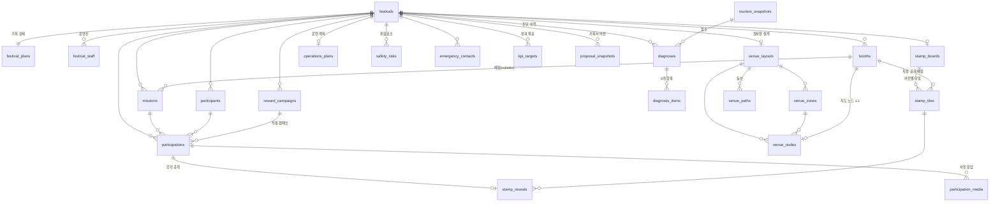

# FestaFlow 데이터 모델

- DBMS: **PostgreSQL 15+** (개발은 동일 스키마의 Postgres 컨테이너 사용. SQLite는 부분 인덱스·enum·jsonb 동작이 달라 권장하지 않음)
- 모든 시각 컬럼은 `timestamptz`, 저장·연산은 **UTC**. 표시와 집계 버킷 경계만 `Asia/Seoul`.
- 삭제는 전부 `archived_at` 설정(soft delete). 물리 삭제는 운영 CLI에서만.
- 금액·포인트는 정수(원, point). 부동소수 금지.

---

## 1. ERD 개요



---

## 2. 열거형

```sql
CREATE TYPE festival_status  AS ENUM ('draft','planning','ready','live','closed');
CREATE TYPE staff_role       AS ENUM ('planner','operator','booth_manager');
CREATE TYPE booth_type       AS ENUM ('food','experience','performance','information','local_shop','etc');
CREATE TYPE booth_verify_mode AS ENUM ('staff_scan','participant_scan');
CREATE TYPE participation_status AS ENUM ('issued','completed');
CREATE TYPE diagnosis_status AS ENUM ('pending','running','completed','failed');
CREATE TYPE risk_level       AS ENUM ('stable','caution','risk');
CREATE TYPE diagnosis_category AS ENUM
  ('tourism_demand','crowd_safety','program_balance','local_linkage','ops_readiness');
CREATE TYPE reveal_mode      AS ENUM ('random','booth_assigned');
CREATE TYPE grant_unit       AS ENUM ('booth','mission');
CREATE TYPE tourism_provider AS ENUM ('kto_live','demo');

-- 기획 파이프라인 (5.0)
CREATE TYPE plan_stage      AS ENUM ('draft','layout','operations','proposal');

-- 행사장 설계 (04)
CREATE TYPE zone_kind       AS ENUM ('stage','food','experience','market','rest','ops','entry');
CREATE TYPE node_type       AS ENUM ('booth','program','facility','staff_post');
CREATE TYPE path_kind       AS ENUM ('main','sub','emergency');

-- 부스 QR 체험 (05)
CREATE TYPE experience_type AS ENUM ('stamp','quiz','photo','survey','info');

-- 안전 계획 (5.7)
CREATE TYPE risk_grade      AS ENUM ('low','medium','high');

-- 실무 검토 반영 (E)
CREATE TYPE visitor_source  AS ENUM ('manual_counter','beacon','partner','estimate');
CREATE TYPE booth_qr_mode   AS ENUM ('printed','rotating');
CREATE TYPE diagnosis_display AS ENUM ('checklist','score');
CREATE TYPE plan_tier       AS ENUM ('per_festival','annual','enterprise');
```

노드의 세부 종류(운영본부·안내소·안전요원…)는 enum이 아니라 `venue_nodes.kind TEXT`입니다.
팔레트 항목은 운영하면서 계속 늘어나는데, 그때마다 enum 마이그레이션을 돌리는 비용이
타입 안전성 이득보다 크기 때문입니다. 상위 분류인 `node_type`만 enum으로 고정합니다.

> `participation_status`에 `issued`를 둔 이유: 부스 지급 트랜잭션이 조각 공개 단계에서 실패하면
> 전체 롤백이므로 실제로는 `completed`만 남습니다. `issued`는 향후 "참여자 선점 → 부스 확인" 2단계
> 플로우를 도입할 때를 위한 자리이며, 현재 집계 쿼리는 모두 `status='completed'`만 셉니다.

---

## 3. 축제

```sql
CREATE TABLE festivals (
  id                BIGINT GENERATED ALWAYS AS IDENTITY PRIMARY KEY,
  name              TEXT        NOT NULL CHECK (char_length(name) BETWEEN 2 AND 120),
  region            TEXT        NOT NULL,
  venue             TEXT        NOT NULL,
  starts_on         DATE        NOT NULL,
  ends_on           DATE        NOT NULL,
  expected_visitors INTEGER     NOT NULL CHECK (expected_visitors > 0),
  total_budget      BIGINT      NOT NULL CHECK (total_budget >= 0),
  organization_id   BIGINT      NOT NULL REFERENCES organizations(id) ON DELETE RESTRICT,
  status            festival_status NOT NULL DEFAULT 'planning',
  plan_stage        plan_stage  NOT NULL DEFAULT 'draft',  -- 진행 표시일 뿐 다음 단계를 잠그지 않음
  is_demo           BOOLEAN     NOT NULL DEFAULT FALSE,
  -- 사진 체험은 개인정보 부담이 커서 명시적으로 켜야 함 (E6)
  allow_photo_experience BOOLEAN NOT NULL DEFAULT FALSE,
  -- TourAPI 지역 코드 해석 결과 캐시 (6.2)
  area_code         TEXT,
  sigungu_code      TEXT,
  legal_dong_code   TEXT,
  created_at        TIMESTAMPTZ NOT NULL DEFAULT now(),
  updated_at        TIMESTAMPTZ NOT NULL DEFAULT now(),
  archived_at       TIMESTAMPTZ,
  CONSTRAINT festivals_period_valid CHECK (ends_on >= starts_on)
);

CREATE INDEX festivals_active_recent_idx
  ON festivals (organization_id, created_at DESC, id DESC) WHERE archived_at IS NULL;
```

`ends_on >= starts_on`은 **DB CHECK / API 422 / 폼 검증** 세 곳에서 모두 막습니다(원문 규칙 유지).
행사 일수 = `ends_on - starts_on + 1` (당일 축제 = 1일).

### 3.1 기획 상세 (1:1 분리)

```sql
CREATE TABLE festival_plans (
  festival_id BIGINT PRIMARY KEY REFERENCES festivals(id) ON DELETE CASCADE,

  summary        TEXT,                    -- 한 줄 소개
  description    TEXT,
  purposes       TEXT[] NOT NULL DEFAULT '{}',   -- 개최 목적(복수)
  target_segments TEXT[] NOT NULL DEFAULT '{}',  -- 세부 타깃(복수)
  core_audience  TEXT,                    -- 핵심 방문 대상

  -- 운영 규모
  staff_count       INTEGER CHECK (staff_count       >= 0),
  volunteer_count   INTEGER CHECK (volunteer_count   >= 0),
  safety_staff_count INTEGER CHECK (safety_staff_count >= 0),
  parking_capacity  INTEGER CHECK (parking_capacity  >= 0),
  venue_capacity    INTEGER CHECK (venue_capacity    >= 0),  -- 동시 수용 인원

  -- 예정 프로그램 수 (6개 유형 고정)
  planned_performance INTEGER NOT NULL DEFAULT 0 CHECK (planned_performance >= 0),
  planned_experience  INTEGER NOT NULL DEFAULT 0 CHECK (planned_experience  >= 0),
  planned_food        INTEGER NOT NULL DEFAULT 0 CHECK (planned_food        >= 0),
  planned_local_shop  INTEGER NOT NULL DEFAULT 0 CHECK (planned_local_shop  >= 0),
  planned_tour_info   INTEGER NOT NULL DEFAULT 0 CHECK (planned_tour_info   >= 0),
  planned_etc         INTEGER NOT NULL DEFAULT 0 CHECK (planned_etc         >= 0),

  -- 교통·혼잡·안전
  transit_access TEXT,
  traffic_plan   TEXT,
  crowd_plan     TEXT,
  safety_plan    TEXT,

  -- 지역 관광 연계
  tourism_link_plan   TEXT,
  local_commerce_plan TEXT,
  lodging_plan        TEXT,
  promotion_plan      TEXT,

  updated_at TIMESTAMPTZ NOT NULL DEFAULT now()
);
```

축제 생성 시 `festival_plans` 행을 **항상 함께 생성**합니다(전부 NULL이더라도).
"비어 있는 계획 정보"는 운영 준비도 진단에서 부족 항목으로 잡힙니다.

---

## 4. 접근 제어 (신규)

```sql
CREATE TABLE festival_staff (
  id           BIGINT GENERATED ALWAYS AS IDENTITY PRIMARY KEY,
  festival_id  BIGINT NOT NULL REFERENCES festivals(id) ON DELETE CASCADE,
  role         staff_role NOT NULL,
  display_name TEXT   NOT NULL,
  booth_id     BIGINT REFERENCES booths(id) ON DELETE SET NULL, -- booth_manager 전용
  access_code_hash TEXT NOT NULL,        -- 6자리 코드의 해시. 평문 저장 금지
  is_active    BOOLEAN NOT NULL DEFAULT TRUE,
  last_login_at TIMESTAMPTZ,
  created_at   TIMESTAMPTZ NOT NULL DEFAULT now(),
  CONSTRAINT staff_booth_role_valid
    CHECK (role = 'booth_manager' OR booth_id IS NULL)
);

CREATE INDEX festival_staff_festival_idx ON festival_staff (festival_id) WHERE is_active;
```

- 접근 코드는 발급 응답에서 **1회만** 평문 노출합니다. 분실 시 재발급.
- 세션은 서명된 토큰(JWT 등)에 `staff_id`, `festival_id`, `role`, `booth_id`를 담습니다.
- `booth_manager` 토큰은 `booth_id`가 일치하는 부스의 미션만 지급할 수 있습니다(서버 강제).

---

## 5. 부스 · 미션

```sql
CREATE TABLE booths (
  id           BIGINT GENERATED ALWAYS AS IDENTITY PRIMARY KEY,
  festival_id  BIGINT NOT NULL REFERENCES festivals(id) ON DELETE CASCADE,
  name         TEXT NOT NULL CHECK (char_length(name) BETWEEN 2 AND 120),
  booth_type   booth_type NOT NULL,
  type_label   TEXT CHECK (type_label IS NULL OR char_length(type_label) <= 60),
  location     TEXT CHECK (location   IS NULL OR char_length(location)   <= 200),
  manager_name TEXT CHECK (manager_name IS NULL OR char_length(manager_name) <= 120),
  is_active    BOOLEAN NOT NULL DEFAULT TRUE,

  -- QR 확인 방식 (부스별 선택)
  verify_mode  booth_verify_mode NOT NULL DEFAULT 'staff_scan',
  qr_mode      booth_qr_mode     NOT NULL DEFAULT 'printed',  -- E4: 인쇄가 기본, 회전은 상위 옵션
  qr_secret    BYTEA NOT NULL DEFAULT gen_random_bytes(32),   -- 회전/고정 토큰 공용 HMAC 키

  -- QR 체험 화면 테마 (05) — cover_image_url, accent_color, greeting, complete_message, intro
  use_experience   BOOLEAN NOT NULL DEFAULT FALSE,
  experience_theme JSONB   NOT NULL DEFAULT '{}'::jsonb,

  created_at   TIMESTAMPTZ NOT NULL DEFAULT now(),
  updated_at   TIMESTAMPTZ NOT NULL DEFAULT now(),
  archived_at  TIMESTAMPTZ
);

CREATE UNIQUE INDEX booths_name_unique
  ON booths (festival_id, lower(name)) WHERE archived_at IS NULL;
CREATE INDEX booths_festival_idx ON booths (festival_id) WHERE archived_at IS NULL;

CREATE TABLE missions (
  id          BIGINT GENERATED ALWAYS AS IDENTITY PRIMARY KEY,
  festival_id BIGINT NOT NULL REFERENCES festivals(id) ON DELETE CASCADE,
  booth_id    BIGINT REFERENCES booths(id) ON DELETE SET NULL,  -- NULL = 미배정
  title       TEXT NOT NULL CHECK (char_length(title) BETWEEN 2 AND 120),
  description TEXT CHECK (description IS NULL OR char_length(description) <= 2000),
  points      INTEGER NOT NULL DEFAULT 0 CHECK (points BETWEEN 0 AND 1000000),
  is_active   BOOLEAN NOT NULL DEFAULT TRUE,

  -- QR 체험 (05)
  experience_type   experience_type NOT NULL DEFAULT 'stamp',
  experience_config JSONB NOT NULL DEFAULT '{}'::jsonb,

  created_at  TIMESTAMPTZ NOT NULL DEFAULT now(),
  updated_at  TIMESTAMPTZ NOT NULL DEFAULT now(),
  archived_at TIMESTAMPTZ
);

CREATE INDEX missions_booth_idx ON missions (booth_id) WHERE archived_at IS NULL;
```

**교차 축제 방지**: `missions.booth_id`가 가리키는 부스의 `festival_id`가 미션과 다르면 서비스 계층에서
`400`으로 차단합니다(원문 규칙 유지). DB 차원에서 강제하려면 `(id, festival_id)` 복합 UNIQUE를 두고
복합 FK를 거는 방법이 있으며, 마이그레이션 v2에서 도입 예정입니다.

**삭제 정책 변경**
- 부스 삭제 → `archived_at` 설정. 소속 미션은 `booth_id = NULL`로 미배정 전환, 타일 배정 해제.
  공개 이력 유무와 무관하게 동작하므로 원문의 `409` 차단은 **불필요해져 제거**합니다.
  이력은 `participations.booth_id` 스냅샷에 남아 있어 리포트가 깨지지 않습니다.
- 미션 삭제 → `archived_at` 설정. 참여 이력은 `mission_id`를 유지합니다.
  (원문은 `mission_id`를 NULL로 바꿨지만, 아카이브 방식에서는 그럴 필요가 없고
  "어떤 미션이었는지"를 리포트에서 계속 보여줄 수 있습니다.)

### 5.1 부스 QR 확인 방식

`booths.verify_mode`로 부스마다 확인 방식을 고릅니다.

| 값 | 스캔 방향 | 검증하는 것 | 적합한 부스 |
|---|---|---|---|
| `staff_scan` | 스태프가 참여자 QR을 스캔 | 미션 **수행** (사람이 눈으로 확인) | 체험·공연·먹거리처럼 실제 활동이 있는 부스 |
| `participant_scan` | 참여자가 부스의 회전 QR을 스캔 | 현장 **방문** (그 시각 그 자리에 있었음) | 스탬프만 찍는 순회 포인트, 관광안내·지역상점 |

**회전 QR 토큰 (participant_scan)** — 별도 테이블 없이 HMAC으로 만듭니다.

```
window_index = floor(unix_seconds / 30)
token        = base64url(HMAC_SHA256(booth.qr_secret, booth_id || window_index))[0:12]
```

부스 화면은 30초마다 새 토큰을 받아 QR을 갱신하고, 서버는 **현재 window와 직전 window**를
허용합니다(시계 오차 대응, 실질 유효기간 30~60초). 토큰이 담긴 QR 사진이 단톡방에 돌아도
30초 뒤에는 쓸 수 없으므로 현장에 오지 않은 사람의 원격 완료를 막습니다.

```sql
CREATE TABLE booth_scan_uses (
  id             BIGINT GENERATED ALWAYS AS IDENTITY PRIMARY KEY,
  booth_id       BIGINT NOT NULL REFERENCES booths(id) ON DELETE CASCADE,
  window_index   BIGINT NOT NULL,
  participant_id BIGINT NOT NULL REFERENCES participants(id) ON DELETE CASCADE,
  participation_id BIGINT REFERENCES participations(id) ON DELETE SET NULL,
  used_at        TIMESTAMPTZ NOT NULL DEFAULT now(),
  CONSTRAINT booth_scan_uses_unique UNIQUE (booth_id, window_index, participant_id)
);

CREATE INDEX booth_scan_uses_cleanup_idx ON booth_scan_uses (used_at);
```

**1 스캔 = 1 미션 지급**입니다. 유니크 제약이 없으면 참여자가 한 번 스캔한 뒤
그 부스의 미션 3개를 한꺼번에 완료할 수 있습니다. `participant_scan`은 방문을 확인할 뿐
개별 미션 수행을 확인하지 못하므로, 같은 window에서 두 번째 지급은 거부하고
"다시 스캔해 주세요"를 안내합니다.

`used_at`이 24시간 지난 행은 일 1회 배치로 정리합니다(축제 종료 후에는 전량 삭제 가능 —
지급 사실 자체는 `participations`에 남습니다).

`qr_secret`의 `gen_random_bytes`는 `pgcrypto` 확장이 필요합니다.

```sql
CREATE EXTENSION IF NOT EXISTS pgcrypto;
```

부스 QR 화면은 `booth_manager` 또는 `operator` 토큰으로 인증된 세션만 열 수 있습니다.
`qr_secret`은 API 응답에 절대 포함하지 않으며, 서버가 계산한 토큰 문자열만 내려줍니다.

---

## 6. 참여자 · 참여 이력

```sql
CREATE TABLE participants (
  id          BIGINT GENERATED ALWAYS AS IDENTITY PRIMARY KEY,
  festival_id BIGINT NOT NULL REFERENCES festivals(id) ON DELETE CASCADE,
  code        TEXT   NOT NULL CHECK (code ~ '^FF-[0-9A-Z]{8}$'),
  secret_hash TEXT   NOT NULL,      -- 조회 인증용. 발급 시 1회만 평문 전달

  -- 기기 변경 복구 (E5). 선택 입력이며 축제별 솔트로 해시만 저장
  recovery_hash     TEXT,
  recovery_attempts SMALLINT NOT NULL DEFAULT 0 CHECK (recovery_attempts >= 0),
  -- 개인 단위 추적 종료 시점 (E6). 찍히면 code는 파기된 상태
  anonymized_at TIMESTAMPTZ,

  created_at  TIMESTAMPTZ NOT NULL DEFAULT now(),
  last_seen_at TIMESTAMPTZ,
  CONSTRAINT participants_code_unique UNIQUE (festival_id, code)
);

CREATE TABLE participations (
  id            BIGINT GENERATED ALWAYS AS IDENTITY PRIMARY KEY,
  festival_id   BIGINT NOT NULL REFERENCES festivals(id) ON DELETE CASCADE,
  participant_id BIGINT NOT NULL REFERENCES participants(id) ON DELETE CASCADE,
  mission_id    BIGINT REFERENCES missions(id) ON DELETE SET NULL,
  booth_id      BIGINT REFERENCES booths(id)  ON DELETE SET NULL,  -- 지급 시점 스냅샷

  status        participation_status NOT NULL DEFAULT 'completed',
  completed_at  TIMESTAMPTZ,

  -- 포인트 스냅샷 (지급 시점 고정)
  base_points   INTEGER NOT NULL DEFAULT 0 CHECK (base_points  >= 0),
  bonus_points  INTEGER NOT NULL DEFAULT 0 CHECK (bonus_points >= 0),
  granted_points INTEGER GENERATED ALWAYS AS (base_points + bonus_points) STORED,
  reward_campaign_id BIGINT REFERENCES reward_campaigns(id) ON DELETE SET NULL,

  -- 지급 경로 (감사·리포트용)
  verified_via  booth_verify_mode,
  -- 체험 응답 (05). quiz 정답 여부, survey 응답, info 체류시간 등
  response      JSONB,
  attempt_count SMALLINT NOT NULL DEFAULT 1 CHECK (attempt_count >= 1),
  granted_by_staff_id BIGINT REFERENCES festival_staff(id) ON DELETE SET NULL,

  -- 오프라인 큐 동기화 (E3). 클라이언트가 만든 멱등 키
  client_request_id UUID,
  queued_at     TIMESTAMPTZ,        -- 오프라인에서 지급 버튼을 누른 시각
  synced_at     TIMESTAMPTZ,        -- 서버에 도달한 시각

  created_at    TIMESTAMPTZ NOT NULL DEFAULT now(),

  CONSTRAINT participations_completed_consistent
    CHECK ((status = 'completed') = (completed_at IS NOT NULL))
);

-- 중복 지급 방지 (A4)
CREATE UNIQUE INDEX participations_unique_grant
  ON participations (participant_id, mission_id) WHERE mission_id IS NOT NULL;

-- 오프라인 재전송이 중복 지급이 되지 않게 (E3)
CREATE UNIQUE INDEX participations_client_request_unique
  ON participations (client_request_id) WHERE client_request_id IS NOT NULL;

-- 운영 인사이트 / 리포트 집계용
CREATE INDEX participations_festival_time_idx
  ON participations (festival_id, completed_at DESC) WHERE status = 'completed';
CREATE INDEX participations_booth_time_idx
  ON participations (booth_id, completed_at DESC) WHERE status = 'completed';
CREATE INDEX participations_participant_idx ON participations (participant_id);
```

`granted_points`는 **생성 컬럼**이라 애플리케이션이 합계를 잘못 계산할 여지가 없습니다.
원문의 "스냅샷이 null인 기존 이력은 현재 미션 포인트로 대체" 호환 규칙은
신규 스키마에서는 `NOT NULL DEFAULT 0`이므로 **불필요합니다**(마이그레이션 시 1회 백필).

---

## 7. 스탬프 이미지 보드

```sql
CREATE TABLE stamp_boards (
  id          BIGINT GENERATED ALWAYS AS IDENTITY PRIMARY KEY,
  festival_id BIGINT NOT NULL UNIQUE REFERENCES festivals(id) ON DELETE CASCADE,
  version     INTEGER NOT NULL DEFAULT 1 CHECK (version >= 1),
  rows        SMALLINT NOT NULL CHECK (rows BETWEEN 2 AND 3),
  cols        SMALLINT NOT NULL CHECK (cols BETWEEN 2 AND 3),
  reveal_mode reveal_mode NOT NULL DEFAULT 'random',
  grant_unit  grant_unit  NOT NULL DEFAULT 'booth',
  image_url   TEXT NOT NULL DEFAULT '/images/chuncheon-stamp-board.png',
  complete_message TEXT NOT NULL DEFAULT '모든 축제 조각을 완성했습니다!',
  created_at  TIMESTAMPTZ NOT NULL DEFAULT now(),
  updated_at  TIMESTAMPTZ NOT NULL DEFAULT now(),
  CONSTRAINT stamp_boards_grid_supported
    CHECK ((rows, cols) IN ((2,2),(2,3),(3,3)))
);

CREATE TABLE stamp_tiles (
  id            BIGINT GENERATED ALWAYS AS IDENTITY PRIMARY KEY,
  board_id      BIGINT   NOT NULL REFERENCES stamp_boards(id) ON DELETE CASCADE,
  board_version INTEGER  NOT NULL,
  tile_index    SMALLINT NOT NULL CHECK (tile_index >= 0),
  assigned_booth_id BIGINT REFERENCES booths(id) ON DELETE SET NULL,
  CONSTRAINT stamp_tiles_unique UNIQUE (board_id, board_version, tile_index)
);

-- 한 부스는 한 버전 안에서 한 타일에만 배정
CREATE UNIQUE INDEX stamp_tiles_booth_unique
  ON stamp_tiles (board_id, board_version, assigned_booth_id)
  WHERE assigned_booth_id IS NOT NULL;

CREATE TABLE stamp_reveals (
  id             BIGINT GENERATED ALWAYS AS IDENTITY PRIMARY KEY,
  board_id       BIGINT NOT NULL REFERENCES stamp_boards(id) ON DELETE CASCADE,
  board_version  INTEGER NOT NULL,
  participant_id BIGINT NOT NULL REFERENCES participants(id) ON DELETE CASCADE,
  tile_id        BIGINT NOT NULL REFERENCES stamp_tiles(id) ON DELETE CASCADE,
  booth_id       BIGINT REFERENCES booths(id) ON DELETE SET NULL,
  participation_id BIGINT REFERENCES participations(id) ON DELETE SET NULL,
  revealed_at    TIMESTAMPTZ NOT NULL DEFAULT now(),

  -- 한 타일은 참여자당 1회
  CONSTRAINT stamp_reveals_tile_unique UNIQUE (board_version, participant_id, tile_id)
);

-- grant_unit='booth'일 때: 부스당 1조각 (C2)
CREATE UNIQUE INDEX stamp_reveals_booth_unique
  ON stamp_reveals (board_id, board_version, participant_id, booth_id)
  WHERE booth_id IS NOT NULL;

CREATE INDEX stamp_reveals_lookup_idx
  ON stamp_reveals (board_id, board_version, participant_id);
```

**버전 전환 규칙 (C1)**
- `rows`/`cols`/`reveal_mode`/`grant_unit` 중 하나라도 바뀌면 `version += 1`, 새 타일 집합 생성.
- 기존 `stamp_reveals`는 **삭제하지 않습니다**. 이전 버전 기록으로 남습니다.
- 참여자 보드 조회는 `board.version`과 일치하는 reveal만 집계합니다.
- 공개 이력이 존재하면 API가 `409 + requires_confirmation`을 반환하고,
  클라이언트가 `?confirm=true`를 붙여야 진행합니다.
- `image_url`/`complete_message`만 바꾸는 것은 버전 변경이 아닙니다(진행 유지).

**완성 가능성 경고 (C2)**
`rows*cols > 지급 단위 수`이면 대시보드·진단에 경고를 노출합니다.
지급 단위 수 = `grant_unit='booth'` → 활성 부스 수, `'mission'` → 활성 미션 수.

---

## 8. 보상 캠페인

```sql
CREATE TABLE reward_campaigns (
  id          BIGINT GENERATED ALWAYS AS IDENTITY PRIMARY KEY,
  festival_id BIGINT NOT NULL REFERENCES festivals(id) ON DELETE CASCADE,
  booth_id    BIGINT NOT NULL REFERENCES booths(id)   ON DELETE CASCADE,
  mission_id  BIGINT REFERENCES missions(id) ON DELETE CASCADE,  -- NULL = 부스 전체 활성 미션
  title        TEXT NOT NULL CHECK (char_length(title) BETWEEN 2 AND 120),
  message      TEXT NOT NULL CHECK (char_length(message) <= 500),
  bonus_points INTEGER NOT NULL CHECK (bonus_points >= 0),
  starts_at   TIMESTAMPTZ NOT NULL,
  ends_at     TIMESTAMPTZ NOT NULL,
  is_active   BOOLEAN NOT NULL DEFAULT TRUE,
  created_by_staff_id BIGINT REFERENCES festival_staff(id) ON DELETE SET NULL,
  created_at  TIMESTAMPTZ NOT NULL DEFAULT now(),
  CONSTRAINT reward_campaigns_window_valid CHECK (ends_at > starts_at)
);

CREATE INDEX reward_campaigns_active_idx
  ON reward_campaigns (festival_id, starts_at, ends_at) WHERE is_active;
```

- 활성 판정: `is_active AND starts_at <= now() AND now() <= ends_at` (서버 시각 기준, 원문 유지).
- 겹치는 캠페인이 여러 건이면 **합산하지 않고 `bonus_points` 최댓값 1건만** 적용(원문 유지).
  적용된 캠페인 ID는 `participations.reward_campaign_id`에 기록되어 사후 추적이 가능해집니다.
- `booth_id`/`mission_id`는 반드시 같은 축제 소속이어야 하며 서비스 계층에서 검증합니다.

---

## 9. 진단

```sql
CREATE TABLE tourism_snapshots (
  id          BIGINT GENERATED ALWAYS AS IDENTITY PRIMARY KEY,
  region_key  TEXT NOT NULL,             -- 정규화된 지역명 + 코드
  base_month  CHAR(6) NOT NULL,          -- YYYYMM
  provider    tourism_provider NOT NULL,

  stay_index          NUMERIC(10,4),
  spend_index         NUMERIC(10,4),
  demand_index        NUMERIC(10,4),
  season_fit          NUMERIC(5,4),      -- 0~1
  content_count       INTEGER,
  estimated_daily_capacity INTEGER,      -- FestaFlow 추정치
  congestion_risk     NUMERIC(5,4),      -- FestaFlow 추정치, 0~1
  local_link_readiness NUMERIC(5,4),     -- FestaFlow 추정치, 0~1
  resources   JSONB NOT NULL DEFAULT '[]'::jsonb,  -- 대표 관광자원 최대 8개
  source_note TEXT NOT NULL,
  fetched_at  TIMESTAMPTZ NOT NULL DEFAULT now(),
  expires_at  TIMESTAMPTZ NOT NULL,
  CONSTRAINT tourism_snapshots_unique UNIQUE (region_key, base_month, provider)
);

CREATE TABLE diagnoses (
  id          BIGINT GENERATED ALWAYS AS IDENTITY PRIMARY KEY,
  festival_id BIGINT NOT NULL REFERENCES festivals(id) ON DELETE CASCADE,
  status      diagnosis_status NOT NULL DEFAULT 'pending',
  rubric_version TEXT NOT NULL DEFAULT 'v1',
  total_score NUMERIC(5,2) CHECK (total_score BETWEEN 0 AND 100),
  risk        risk_level,
  input_snapshot JSONB,                  -- 계산에 쓴 축제·기획·부스·미션 값 전체
  tourism_snapshot_id BIGINT REFERENCES tourism_snapshots(id) ON DELETE SET NULL,
  error_message TEXT,
  requested_by_staff_id BIGINT REFERENCES festival_staff(id) ON DELETE SET NULL,
  created_at   TIMESTAMPTZ NOT NULL DEFAULT now(),
  completed_at TIMESTAMPTZ
);

CREATE INDEX diagnoses_latest_idx ON diagnoses (festival_id, created_at DESC);

CREATE TABLE diagnosis_items (
  id           BIGINT GENERATED ALWAYS AS IDENTITY PRIMARY KEY,
  diagnosis_id BIGINT NOT NULL REFERENCES diagnoses(id) ON DELETE CASCADE,
  category     diagnosis_category NOT NULL,
  score        NUMERIC(5,2) NOT NULL CHECK (score >= 0),
  max_score    NUMERIC(5,2) NOT NULL CHECK (max_score > 0),
  level        risk_level NOT NULL,
  reason         TEXT NOT NULL,   -- 계산 근거
  recommendation TEXT NOT NULL,   -- 개선 제안
  details      JSONB NOT NULL DEFAULT '{}'::jsonb,
  CONSTRAINT diagnosis_items_unique UNIQUE (diagnosis_id, category),
  CONSTRAINT diagnosis_items_score_bound CHECK (score <= max_score)
);
```

**이력 조회 (B1)**
| 목적 | 쿼리 |
|---|---|
| 최신 진단 | `WHERE festival_id=? AND status='completed' ORDER BY created_at DESC LIMIT 1` |
| 직전 대비 비교 | 같은 조건 `LIMIT 2` — 1건뿐이면 "첫 진단" 안내 |
| 전체 이력 | 같은 조건, 최신순 페이지네이션 |

스냅샷 복사도, 최신 진단 교체도 없습니다.
`input_snapshot`과 `rubric_version`이 있으므로 어떤 진단이든 **당시 값 그대로 재현·설명**됩니다.

---

## 10. 마이그레이션 순서

FK 의존 때문에 아래 순서로 생성합니다.

```
1. enum 타입
2. festivals
3. festival_plans, tourism_snapshots
4. booths          (festival_staff.booth_id FK는 booths 생성 후 ALTER로 추가)
5. missions, festival_staff
6. participants
7. reward_campaigns
8. participations   (reward_campaigns, festival_staff 참조)
9. booth_scan_uses, participation_media  (participations 참조)
10. stamp_boards → stamp_tiles → stamp_reveals
11. diagnoses → diagnosis_items
12. venue_layouts → venue_zones → venue_nodes → venue_paths → venue_layout_snapshots
13. operations_plans, safety_risks, emergency_contacts, kpi_targets
14. proposal_snapshots
15. 인덱스 일괄 생성
```

`venue_nodes`는 `booths`와 자기 자신(`linked_program_node_id`)을 참조하므로
`booths` 생성 이후에 와야 하며, 자기 참조 FK는 테이블 생성과 함께 걸어도 문제없습니다.

0단계로 `CREATE EXTENSION IF NOT EXISTS pgcrypto;`가 필요합니다(`booths.qr_secret` 기본값).

`festival_staff`와 `booths`는 상호 참조이므로, `festival_staff.booth_id` FK만
`ALTER TABLE ... ADD CONSTRAINT`로 분리해 겁니다.

---

## 11. 축제 삭제(아카이브) 처리

원문은 관계 테이블을 "안전한 순서로 직접 삭제"했지만, 아카이브 방식에서는 한 줄입니다.

```sql
UPDATE festivals SET archived_at = now(), status = 'closed' WHERE id = $1;
```

- 목록·집계 쿼리는 모두 `archived_at IS NULL` 필터를 갖습니다.
- 물리 삭제가 필요하면 `ON DELETE CASCADE`가 이미 전 테이블에 걸려 있어
  `DELETE FROM festivals WHERE id=$1` 한 번으로 정리됩니다.
  순서를 손으로 관리할 필요가 없습니다.
- 운영 CLI `purge_festival --id N --confirm`은 아카이브 후 30일 경과 건,
  또는 `is_demo = true` 건만 허용합니다.
- `DEMO_MODE=true`이고 데모 축제가 0건이면 서버 기동 시 1건을 시드합니다.
  기본값은 `false`이므로 삭제한 데모 축제가 되살아나지 않습니다(원문 의도 유지).

---

## 12. 행사장 설계 (STEP 2)

좌표는 전부 **미터** 단위입니다. 픽셀로 저장하면 면적 대비 수용 인원과
동선 폭을 계산할 수 없습니다.

```sql
CREATE TABLE venue_layouts (
  id          BIGINT GENERATED ALWAYS AS IDENTITY PRIMARY KEY,
  festival_id BIGINT NOT NULL UNIQUE REFERENCES festivals(id) ON DELETE CASCADE,
  version     INTEGER NOT NULL DEFAULT 1 CHECK (version >= 1),
  width_m     NUMERIC(8,2) NOT NULL CHECK (width_m  > 0),
  height_m    NUMERIC(8,2) NOT NULL CHECK (height_m > 0),
  opens_at    TIME NOT NULL DEFAULT '10:00',
  closes_at   TIME NOT NULL DEFAULT '22:00',
  visitor_curve TEXT NOT NULL DEFAULT 'daytime',  -- daytime | night | family
  created_at  TIMESTAMPTZ NOT NULL DEFAULT now(),
  updated_at  TIMESTAMPTZ NOT NULL DEFAULT now()
);

CREATE TABLE venue_zones (
  id        BIGINT GENERATED ALWAYS AS IDENTITY PRIMARY KEY,
  layout_id BIGINT NOT NULL REFERENCES venue_layouts(id) ON DELETE CASCADE,
  code      TEXT NOT NULL CHECK (char_length(code) <= 4),   -- 'A', 'B'
  name      TEXT NOT NULL,
  kind      zone_kind NOT NULL,
  x_m NUMERIC(8,2) NOT NULL, y_m NUMERIC(8,2) NOT NULL,
  w_m NUMERIC(8,2) NOT NULL CHECK (w_m > 0),
  h_m NUMERIC(8,2) NOT NULL CHECK (h_m > 0),
  capacity_override INTEGER CHECK (capacity_override >= 0),
  CONSTRAINT venue_zones_code_unique UNIQUE (layout_id, code)
);

CREATE TABLE venue_nodes (
  id        BIGINT GENERATED ALWAYS AS IDENTITY PRIMARY KEY,
  layout_id BIGINT NOT NULL REFERENCES venue_layouts(id) ON DELETE CASCADE,
  zone_id   BIGINT REFERENCES venue_zones(id) ON DELETE SET NULL,
  node_type node_type NOT NULL,
  kind      TEXT NOT NULL,          -- 팔레트 항목 코드: 'ops_center', 'safety_staff' 등
  label     TEXT NOT NULL,

  -- booth 노드만 실제 부스 레코드와 1:1 연결
  booth_id  BIGINT UNIQUE REFERENCES booths(id) ON DELETE CASCADE,

  x_m NUMERIC(8,2) NOT NULL, y_m NUMERIC(8,2) NOT NULL,
  w_m NUMERIC(8,2) NOT NULL CHECK (w_m > 0),
  h_m NUMERIC(8,2) NOT NULL CHECK (h_m > 0),
  rotation_deg SMALLINT NOT NULL DEFAULT 0 CHECK (rotation_deg BETWEEN 0 AND 359),

  capacity       INTEGER CHECK (capacity       >= 0),  -- 직접 입력(면적 자동값을 덮어씀)
  staff_required INTEGER NOT NULL DEFAULT 0 CHECK (staff_required >= 0),
  budget         BIGINT  NOT NULL DEFAULT 0 CHECK (budget >= 0),
  opens_at  TIME,
  closes_at TIME,
  linked_program_node_id BIGINT REFERENCES venue_nodes(id) ON DELETE SET NULL,
  memo TEXT,

  CONSTRAINT venue_nodes_booth_only_for_booth_type
    CHECK (node_type = 'booth' OR booth_id IS NULL)
);

CREATE INDEX venue_nodes_layout_idx ON venue_nodes (layout_id);
CREATE INDEX venue_nodes_zone_idx   ON venue_nodes (zone_id);

CREATE TABLE venue_paths (
  id        BIGINT GENERATED ALWAYS AS IDENTITY PRIMARY KEY,
  layout_id BIGINT NOT NULL REFERENCES venue_layouts(id) ON DELETE CASCADE,
  path_kind path_kind NOT NULL,
  from_node_id BIGINT NOT NULL REFERENCES venue_nodes(id) ON DELETE CASCADE,
  to_node_id   BIGINT NOT NULL REFERENCES venue_nodes(id) ON DELETE CASCADE,
  width_m   NUMERIC(5,2) NOT NULL CHECK (width_m > 0),
  waypoints JSONB NOT NULL DEFAULT '[]'::jsonb,   -- [{x_m, y_m}, ...]
  expected_flow_ratio NUMERIC(4,3) CHECK (expected_flow_ratio BETWEEN 0 AND 1),
  CONSTRAINT venue_paths_no_self_loop CHECK (from_node_id <> to_node_id)
);

CREATE INDEX venue_paths_layout_idx ON venue_paths (layout_id);

CREATE TABLE venue_layout_snapshots (
  id        BIGINT GENERATED ALWAYS AS IDENTITY PRIMARY KEY,
  layout_id BIGINT NOT NULL REFERENCES venue_layouts(id) ON DELETE CASCADE,
  version   INTEGER NOT NULL,
  data      JSONB   NOT NULL,     -- zones + nodes + paths 전체 덤프
  created_at TIMESTAMPTZ NOT NULL DEFAULT now(),
  CONSTRAINT venue_layout_snapshots_unique UNIQUE (layout_id, version)
);
```

**설계 체크와 히트맵은 저장하지 않습니다.** 전부 현재 배치에서 계산되는 파생값이고,
저장하면 배치가 바뀔 때마다 동기화 문제가 생깁니다.
`services/layout_checks.py`와 `services/crowd_simulation.py`가 요청 시 계산합니다.

`venue_nodes.booth_id`가 `ON DELETE CASCADE`인 이유는 지도 노드가 부스보다 하위 개념이기
때문입니다. 부스를 아카이브하면 노드는 남고(아카이브 부스는 목록에서 빠질 뿐),
부스를 실제로 purge하면 노드도 함께 사라집니다.

되돌리기는 최근 10개 스냅샷까지 지원하며, 그보다 오래된 행은 배치로 정리합니다.

---

## 13. 체험 응답 미디어

```sql
CREATE TABLE participation_media (
  id BIGINT GENERATED ALWAYS AS IDENTITY PRIMARY KEY,
  participation_id BIGINT NOT NULL REFERENCES participations(id) ON DELETE CASCADE,
  storage_key  TEXT NOT NULL,          -- 오브젝트 스토리지 키. 원본 바이너리는 DB에 넣지 않음
  content_type TEXT NOT NULL,
  bytes        INTEGER NOT NULL CHECK (bytes > 0),
  consent_at   TIMESTAMPTZ NOT NULL,   -- 수집·이용 동의 시각
  expires_on   DATE NOT NULL,          -- 기본: 축제 종료일 + 90일
  deleted_at   TIMESTAMPTZ,            -- 참여자 삭제 요청
  created_at   TIMESTAMPTZ NOT NULL DEFAULT now()
);

CREATE INDEX participation_media_expiry_idx
  ON participation_media (expires_on) WHERE deleted_at IS NULL;
```

`consent_at`이 `NOT NULL`인 것은 의도한 제약입니다.
동의 없이 업로드된 사진이 물리적으로 저장될 수 없어야 합니다.
만료분은 일 1회 배치가 스토리지 객체와 행을 함께 지웁니다.

---

## 14. 운영·안전·성과 목표 (STEP 3)

문서처럼 통째로 편집하는 것은 `jsonb`, 개별 조회·판정·조인이 필요한 것은 테이블로 나눴습니다.

```sql
CREATE TABLE operations_plans (
  festival_id BIGINT PRIMARY KEY REFERENCES festivals(id) ON DELETE CASCADE,
  timetable      JSONB NOT NULL DEFAULT '[]'::jsonb,  -- 프로그램·부스 운영 시간표
  shifts         JSONB NOT NULL DEFAULT '[]'::jsonb,  -- 인력 교대조
  supplies       JSONB NOT NULL DEFAULT '[]'::jsonb,  -- 물자·장비
  prep_checklist JSONB NOT NULL DEFAULT '[]'::jsonb,  -- D-30 / D-7 / D-1 / D-Day
  weather_policy JSONB NOT NULL DEFAULT '{}'::jsonb,  -- 중단 기준과 판단 주체
  evacuation_note TEXT,
  updated_at TIMESTAMPTZ NOT NULL DEFAULT now()
);

CREATE TABLE safety_risks (
  id          BIGINT GENERATED ALWAYS AS IDENTITY PRIMARY KEY,
  festival_id BIGINT NOT NULL REFERENCES festivals(id) ON DELETE CASCADE,
  title       TEXT NOT NULL,
  likelihood  risk_grade NOT NULL,
  impact      risk_grade NOT NULL,
  mitigation  TEXT,
  owner_name  TEXT,
  zone_id     BIGINT REFERENCES venue_zones(id) ON DELETE SET NULL,
  created_at  TIMESTAMPTZ NOT NULL DEFAULT now(),
  updated_at  TIMESTAMPTZ NOT NULL DEFAULT now()
);

CREATE INDEX safety_risks_festival_idx ON safety_risks (festival_id);

CREATE TABLE emergency_contacts (
  id          BIGINT GENERATED ALWAYS AS IDENTITY PRIMARY KEY,
  festival_id BIGINT NOT NULL REFERENCES festivals(id) ON DELETE CASCADE,
  role_name   TEXT NOT NULL,
  person_name TEXT NOT NULL,
  phone       TEXT NOT NULL,
  backup_person_name TEXT,
  backup_phone       TEXT,
  sort_order  SMALLINT NOT NULL DEFAULT 0
);

CREATE TABLE kpi_targets (
  id          BIGINT GENERATED ALWAYS AS IDENTITY PRIMARY KEY,
  festival_id BIGINT NOT NULL REFERENCES festivals(id) ON DELETE CASCADE,
  metric_key  TEXT NOT NULL,        -- 'qr_participants' | 'total_completions' | 'custom:...'
  label       TEXT NOT NULL,
  target_value NUMERIC(14,2) NOT NULL,
  unit        TEXT NOT NULL DEFAULT '건',
  is_measurable BOOLEAN NOT NULL DEFAULT TRUE,
  CONSTRAINT kpi_targets_unique UNIQUE (festival_id, metric_key)
);
```

`safety_risks`를 테이블로 둔 이유는 `likelihood × impact`로 등급을 매기고
"등급이 높은데 `mitigation`이 비어 있는 항목"을 쿼리로 찾아 경고해야 하기 때문입니다.
jsonb 안에 있으면 이 판정을 애플리케이션이 매번 풀어야 합니다.

`kpi_targets.is_measurable`은 목표 방문객처럼 **FestaFlow가 측정할 수 없는 지표**를
표시하는 플래그입니다. `false`인 지표는 리포트에서 달성률을 계산하지 않고
참고값으로만 표시합니다.

---

## 15. 최종 기획서 스냅샷 (STEP 4)

```sql
CREATE TABLE proposal_snapshots (
  id          BIGINT GENERATED ALWAYS AS IDENTITY PRIMARY KEY,
  festival_id BIGINT NOT NULL REFERENCES festivals(id) ON DELETE CASCADE,
  version     INTEGER NOT NULL,
  data        JSONB   NOT NULL,   -- 12개 섹션 렌더 데이터 전체
  created_by_staff_id BIGINT REFERENCES festival_staff(id) ON DELETE SET NULL,
  created_at  TIMESTAMPTZ NOT NULL DEFAULT now(),
  CONSTRAINT proposal_snapshots_unique UNIQUE (festival_id, version)
);

CREATE INDEX proposal_snapshots_latest_idx ON proposal_snapshots (festival_id, version DESC);
```

최종 기획서는 **평소에는 저장하지 않고** 각 원본 테이블에서 조립해 렌더링합니다.
스냅샷은 사용자가 "이 버전 저장"을 눌렀을 때만 남기며,
버전 간 비교(예산이 언제 어떻게 바뀌었는지)에 사용합니다.
항상 저장하면 원본과 스냅샷이 갈라져 어느 쪽이 진짜인지 알 수 없게 됩니다.

---

## 16. 실무 검토 반영 테이블 (E)

### 16.1 기관과 요금제 (E8)

```sql
CREATE TABLE organizations (
  id         BIGINT GENERATED ALWAYS AS IDENTITY PRIMARY KEY,
  name       TEXT NOT NULL,
  kind       TEXT NOT NULL DEFAULT 'agency',   -- agency | government | committee
  plan_tier  plan_tier NOT NULL DEFAULT 'per_festival',
  festival_quota INTEGER,        -- NULL = 무제한 (enterprise)
  contact_email  TEXT,
  is_active  BOOLEAN NOT NULL DEFAULT TRUE,
  created_at TIMESTAMPTZ NOT NULL DEFAULT now()
);
```

축제는 반드시 한 기관에 속합니다(`ON DELETE RESTRICT` — 축제가 딸린 기관은 지울 수 없음).
모든 목록·집계 쿼리는 `organization_id` 필터를 갖습니다.
과금·정산 로직은 계약 형태가 정해진 뒤에 붙이며, 지금은 구조만 열어 둡니다.

**이 컬럼을 지금 넣는 이유**는, 나중에 소급하면 모든 쿼리에 테넌트 필터를 뒤늦게
끼워 넣어야 하고 그건 한 곳만 빠뜨려도 다른 기관 데이터가 새는 종류의 마이그레이션이기
때문입니다.

### 16.2 실측 방문객 (E1)

```sql
CREATE TABLE visitor_counts (
  id          BIGINT GENERATED ALWAYS AS IDENTITY PRIMARY KEY,
  festival_id BIGINT NOT NULL REFERENCES festivals(id) ON DELETE CASCADE,
  count_date  DATE   NOT NULL,
  visitors    INTEGER NOT NULL CHECK (visitors >= 0),
  source      visitor_source NOT NULL,
  note        TEXT,
  recorded_by_staff_id BIGINT REFERENCES festival_staff(id) ON DELETE SET NULL,
  created_at  TIMESTAMPTZ NOT NULL DEFAULT now(),
  CONSTRAINT visitor_counts_unique UNIQUE (festival_id, count_date, source)
);
```

같은 날짜에 여러 출처가 공존할 수 있습니다(입구 계수기와 지자체 집계가 다른 건 정상입니다).
리포트는 **가장 신뢰도 높은 출처 하나**를 골라 쓰고 나머지는 참고로 표시합니다.
우선순위는 `beacon` > `manual_counter` > `partner` > `estimate`입니다.

`estimate`로 계산한 참여율에는 화면과 API 모두에 "주최측 추산 기준" 꼬리표가 붙습니다.
실측이 전혀 없으면 **참여율을 만들지 않습니다** — 기존 참여 규모 지표만 표시합니다.

### 16.3 채점표 검증 기록 (E2)

```sql
CREATE TABLE rubric_calibrations (
  id             BIGINT GENERATED ALWAYS AS IDENTITY PRIMARY KEY,
  rubric_version TEXT NOT NULL UNIQUE,
  sample_size    INTEGER NOT NULL CHECK (sample_size > 0),
  method         TEXT NOT NULL,       -- 무엇과 무엇을 비교했는지
  correlation    NUMERIC(4,3),        -- 사후 성과와의 상관계수
  notes          TEXT,
  validated_by   TEXT NOT NULL,
  validated_at   TIMESTAMPTZ NOT NULL DEFAULT now()
);
```

**진단 표시 모드는 저장하지 않고 유도합니다.**

```sql
-- 이 진단을 점수로 보여줘도 되는가
SELECT EXISTS (
  SELECT 1 FROM rubric_calibrations c
  WHERE c.rubric_version = d.rubric_version AND c.sample_size >= 10
) AS score_disclosed
FROM diagnoses d WHERE d.id = $1;
```

기록이 없으면 `checklist` 모드로 항목별 충족·부분충족·미충족만 보여줍니다.
점수와 세부 항목은 그대로 계산·저장되며 **표시만 감춥니다.**
나중에 검증이 끝나면 과거 진단도 소급해서 점수를 볼 수 있습니다.

`diagnosis_items`에 `level`(stable/caution/risk)이 이미 있으므로,
체크리스트 모드는 이 값을 충족·부분충족·미충족으로 그대로 매핑합니다.
별도 컬럼이 필요 없습니다.

### 16.4 추천 판정 기록 (E7)

```sql
CREATE TABLE recommendation_feedbacks (
  id          BIGINT GENERATED ALWAYS AS IDENTITY PRIMARY KEY,
  festival_id BIGINT NOT NULL REFERENCES festivals(id) ON DELETE CASCADE,
  booth_id    BIGINT REFERENCES booths(id) ON DELETE SET NULL,
  rec_type    TEXT NOT NULL,          -- 'REDISTRIBUTE' | 'NO_ACTIVITY'
  observed_at TIMESTAMPTZ NOT NULL,   -- 추천이 표시된 시각
  verdict     BOOLEAN NOT NULL,       -- true = 현장과 일치함
  staff_id    BIGINT REFERENCES festival_staff(id) ON DELETE SET NULL,
  created_at  TIMESTAMPTZ NOT NULL DEFAULT now()
);

CREATE INDEX recommendation_feedbacks_festival_idx
  ON recommendation_feedbacks (festival_id, rec_type);
```

운영자가 추천 카드에서 "확인함 / 해당 없음"을 누르면 한 행이 쌓입니다.
사후 리포트가 **"추천 N건 중 M건이 현장과 일치(적중률 x%)"** 를 계산해,
다음 축제에서 추천 로직을 점검할 근거로 씁니다.
제품이 자기 추천의 정확도를 스스로 측정하게 만드는 장치입니다.

### 16.5 마이그레이션 순서 갱신

```
0.  CREATE EXTENSION pgcrypto
1.  enum 타입 (visitor_source, booth_qr_mode, plan_tier 포함)
2.  organizations           ← festivals보다 먼저
3.  festivals
4.  festival_plans, tourism_snapshots, rubric_calibrations
5.  booths → missions, festival_staff
6.  participants
7.  reward_campaigns
8.  participations
9.  booth_scan_uses, participation_media
10. stamp_boards → stamp_tiles → stamp_reveals
11. diagnoses → diagnosis_items
12. venue_layouts → venue_zones → venue_nodes → venue_paths → venue_layout_snapshots
13. operations_plans, safety_risks, emergency_contacts, kpi_targets
14. proposal_snapshots
15. visitor_counts, recommendation_feedbacks
16. 인덱스 일괄 생성
```
